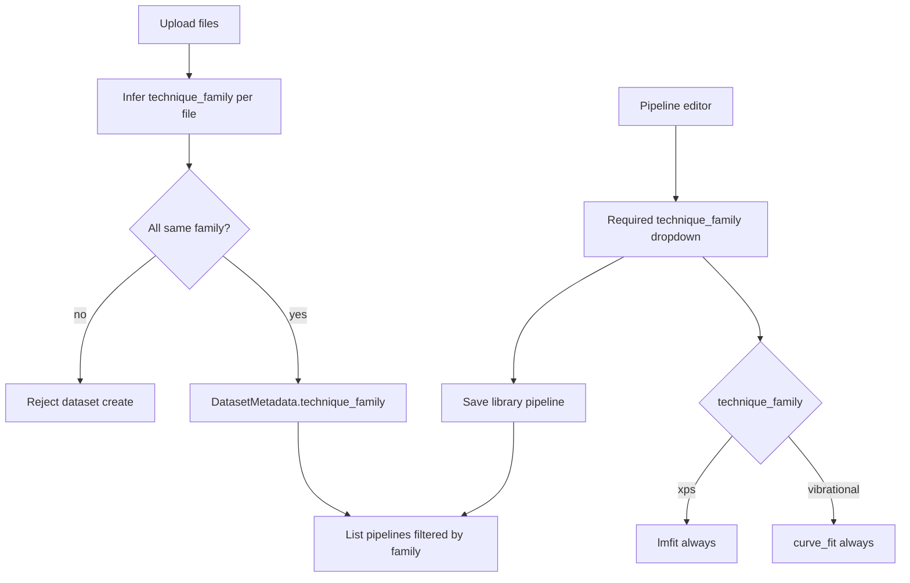

# lmfitxps baselines, dual fitting, and technique families

## Decisions locked in

- **Baseline step:** new `lmfitxps` category with static `shirley` / `tougaard` (pre-subtract).
- **Fit engine (by pipeline technique):** `xps` → **always lmfit**; `vibrational` → **always `curve_fit`**. No per-feature engine switch and no engine dropdown.
- **lmfit-only features (XPS pipelines):** active XPS backgrounds, constraint/link controls, and fitting **region/band** (`O1s`, `Ir4f`, …).
- **Technique families (1A):** `vibrational` (Raman + SERS + FTIR) vs `xps` — dataset metadata, pipeline library filtering, and fit-engine selection.
- **Pipeline technique (2A):** **required** when creating/updating a library pipeline; chosen via dropdown at the top of the step-selection menu.
- Pipelines stay data-independent at runtime (no dataset ids in steps); technique is pipeline/dataset catalog metadata that selects engine and UI affordances.

---

## Part C — Technique identity and pipeline filtering

### C1. Taxonomy

| `technique_family` | Includes | Typical axis | Typical formats |
|--------------------|----------|--------------|-----------------|
| `vibrational` | Raman, SERS, FTIR | wn / wave / wavenumber | `.txt`, `.wdf` |
| `xps` | XPS | BE / Binding energy | `.txt`, `.vms` |

Store **family only** on datasets and pipelines (not separate raman vs sers vs ftir for filtering). Optional finer labels (e.g. XPS region `O1s`) remain a later/labels concern and are not required for this part.

### C2. Inference rules (per file)

Implement a small helper (e.g. `sersflow.core.io.technique.infer_technique_family(path, *, x_axis_label=None) -> Literal["vibrational","xps"]`):

1. **Extension first (strong):**
   - `.wdf` → `vibrational`
   - `.vms` → `xps` (loader support: add VAMAS/`.vms` read path or fail clear “unsupported” until reader lands; extension still reserved for XPS)
2. **For `.txt`:** inspect header / first-column label (case-insensitive):
   - contains `binding` or token `be` as axis name → `xps`
   - contains `wavenumber`, `wave`, or `wn` → `vibrational`
3. If still unknown → raise a clear error asking for a recognizable axis label (do not silently guess).

### C3. Dataset create: single-technique enforcement

On [`DatasetCreateRequest`](src/sersflow/api/schemas/datasets.py) / create path in datasets service:

- Infer family for every `relative_path`.
- If more than one distinct family → **HTTP 400** with message listing conflicting paths/families (e.g. “Cannot mix vibrational and XPS files in one dataset”).
- Persist `technique_family` on [`DatasetMetadata`](src/sersflow/api/schemas/datasets.py).
- Existing datasets without the field: treat as `vibrational` for backward compatibility when listing pipelines (document in migration note).

### C4. Pipeline library: required `technique_family`

- Extend [`PipelineCreateRequest`](src/sersflow/api/schemas/pipelines.py) / library item / SQLite [`pipelines_store`](src/sersflow/infra/pipelines_store.py) with required `technique_family` (`vibrational` | `xps`).
- `GET /pipelines` accepts optional `technique_family=` query; UI always passes the active dataset’s family.
- Saving without a technique → validation error.
- Updating a pipeline may change technique only via the same dropdown (explicit).

**Independence preserved:** pipeline JSON steps do not embed dataset ids; technique is catalog metadata only.

### C5. Frontend

In [`PreprocessingWorkspace.tsx`](frontend/src/PreprocessingWorkspace.tsx), **above** the existing `pipeline-step-picker` (step category buttons):

- Dropdown: **Pipeline type** — `Vibrational (Raman / SERS / FTIR)` | `XPS` (required before save-to-library).
- Persist selection with the editor / library save payload.
- **Saved pipelines** list filtered to the active dataset’s `technique_family`.
- Dataset create / upload errors for mixed techniques shown as clear `err` banners.
- When pipeline type is `xps`: show lmfitxps baseline category, active XPS BG fitting components, **constraints (vary/link)**, and **Region / band** selector on the fitting step; fitting uses lmfit.
- When pipeline type is `vibrational`: hide XPS-only baseline methods, active XPS BG types, constraints/link UI, and region selector; fitting uses `curve_fit`.

### C6. Technique tests

- `.wdf` → vibrational; header BE `.txt` → xps; wn `.txt` → vibrational.
- Mixed paths on create → error.
- Pipeline create rejects missing `technique_family`.
- List filter returns only matching family.

---

## Part A — Static lmfitxps baselines

Docs: [lmfitxps](https://lmfitxps.readthedocs.io/en/latest/) v4.2.0.

| Method id | Callable | Primary params | Returns |
|-----------|----------|----------------|---------|
| `shirley` | `shirley_calculate(x, y, tol=1e-5, maxit=10, bounds=None)` | `tol`, `maxit` | baseline array |
| `tougaard` | `tougaard_calculate(x, y, tb=2866, tc=1643, tcd=1, td=1, maxit=100)` | `tb`, `tc` | `(baseline, B)` |

`bounds` on Shirley is advanced/json nullable. Slope static calculator omitted from baseline category.

Both need **x and y**. Extend [`correct_baseline`](src/sersflow/core/preprocess/baseline.py) and [`_baseline`](src/sersflow/core/pipeline/steps.py) to pass `xy.x`.

### A1–A3

- Dep: `lmfitxps>=4.2.0`.
- Category `{ id: "lmfitxps", label: "lmfitxps (XPS)" }`; dispatch branch; signature drift pybaselines-only.
- Sync [`baselineMethodCatalog.ts`](frontend/src/preprocess/baselineMethodCatalog.ts); tests for metadata/dispatch/x forwarding.

---

## Part B — Dual fitting engines (technique-gated)

### B1. Engine selection

Engine is determined solely by the pipeline’s `technique_family` (set via the Pipeline type dropdown):

| Pipeline type | Fit engine |
|---------------|------------|
| `xps` | **lmfit** (always) |
| `vibrational` | **`curve_fit`** (always) |

Pass `technique_family` into the fitting step / `fit_curve` (from pipeline metadata or step context). Do not switch engines based on whether links or XPS BGs are present — those features simply are not offered on vibrational pipelines.

Session/editor pipelines that are not yet saved must still have a selected pipeline type so fitting knows which engine to use.

### B2. Active XPS backgrounds

Register `shirley_bg`, `tougaard_bg`, `slope_bg` in [`fitting_specs.py`](src/sersflow/core/preprocess/fitting_specs.py). Show only when pipeline type is `xps`. Reject or ignore these component types on vibrational pipelines with a clear error if present in saved JSON.

### B3–B4. XPS fitting options (constraints + region)

Shown **only when pipeline type is `xps`**, at the top of the fitting step editor (before component cards):

1. **Region / band (element subject of the fit)**  
   - Step-level param `xps_region: string` (e.g. `O1s`, `C1s`, `Ir4f`, `Au4f`).  
   - UI: combobox — curated presets + free text.  
   - Meaning: which core-level / region this fitting step is analyzing (one label for the whole fit). Individual peak components keep their own `component_id` for chemical states within that region (e.g. `Ir4f72_ox`).  
   - Persist in fitting step params; when set, prefix exported feature columns with a sanitized region token (e.g. `fit_O1s_p1_amp` or `fit_O1s__p1_amp`) so multi-region pipelines stay distinguishable.  
   - Does not change the optimizer; metadata + naming only.

2. **Constraints**  
   - Per-param **Vary** + **Link** (`equal` | `scale` to another component param).  
   - Serialize `param_links` in step params.  
   - Vibrational: no link UI; p0/bounds only (`vary: false` via equal bounds on `curve_fit` if useful).  
   - No free-form expr / inequalities in this pass.

### B5–B6. lmfit path + tests

Composite lmfit models for XPS; same `FitResult` shape for both engines. Tests: vibrational → `curve_fit` spy; XPS → lmfit path; links + XPS BG smoke; `xps_region` round-trip in params/export; vibrational pipeline rejecting XPS BG / links / region UI fields.

---

## Explicitly out of scope

- Separate pipeline catalogs per Raman vs SERS vs FTIR (all share `vibrational`).
- Free-form lmfit expressions / inequality scaffolding.
- Explicit fit-engine dropdown (engine follows pipeline type only).
- Param links or lmfit on vibrational pipelines.
- XPS BE/KE UI toggle (library infers from x ordering).
- Changing default baseline method (`derpsalsa`).
- Full free-form CasaXPS-style constraint language.
- File-level `xps_region` on upload labels (fitting-step region is in scope; spectrum-label region can come later).

---

## Files to touch

**Technique**

- New: `src/sersflow/core/io/technique.py` (inference)
- [`src/sersflow/core/io/load_file.py`](src/sersflow/core/io/load_file.py) (+ `.vms` support stub/reader as needed)
- [`src/sersflow/api/schemas/datasets.py`](src/sersflow/api/schemas/datasets.py), datasets create service/router
- [`src/sersflow/api/schemas/pipelines.py`](src/sersflow/api/schemas/pipelines.py), [`pipelines_store.py`](src/sersflow/infra/pipelines_store.py), pipelines router
- [`frontend/src/PreprocessingWorkspace.tsx`](frontend/src/PreprocessingWorkspace.tsx), [`frontend/src/preprocess/api.ts`](frontend/src/preprocess/api.ts)

**Baseline / fitting / deps** — as in Parts A–B
- [`baseline.py`](src/sersflow/core/preprocess/baseline.py), [`steps.py`](src/sersflow/core/pipeline/steps.py), [`fitting.py`](src/sersflow/core/preprocess/fitting.py), [`fitting_specs.py`](src/sersflow/core/preprocess/fitting_specs.py), [`fittingUtils.ts`](frontend/src/preprocess/fittingUtils.ts), [`pyproject.toml`](pyproject.toml), tests
